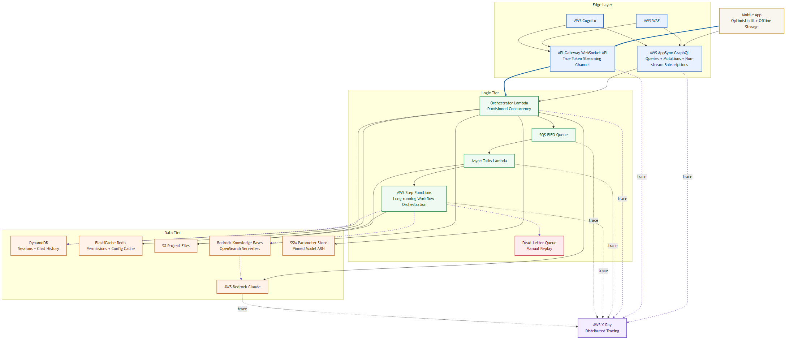

# Technical Spec: Claude Cowork Backend

# 

## 1. Executive Summary

This architecture defines a high-performance, scalable backend designed to support the **Claude Cowork** mobile experience. It prioritizes low-latency AI interactions, secure multi-tenant project collaboration, and a "Serverless-First" approach to balance startup feasibility with enterprise-grade scale.

## 2. Architecture Overview

The system utilizes a **Hub-and-Spoke** model centered around an asynchronous orchestration layer.

- **Mobile Entry:** AWS AppSync (GraphQL) handles queries, mutations, and non-streaming subscriptions. Per-token AI streaming is delivered via **API Gateway WebSocket API** with Lambda Response Streaming, which natively supports Bedrock's `InvokeModelWithResponseStream` for true per-token delivery. AppSync cannot sustain a continuous byte stream and is not suited for this role.
- **Intelligence:** AWS Bedrock (Claude 3.5 Sonnet) handles core inference, while **Amazon Bedrock Knowledge Bases** (backed by OpenSearch Serverless) enables Retrieval-Augmented Generation (RAG) for project files — entirely within the AWS VPC.
- **Persistence:** DynamoDB handles session state and chat history with sub-millisecond latency, using pre-defined access patterns to avoid hot partitions.
- **Resilience:** An SQS FIFO queue with a Dead-Letter Queue (DLQ) buffers async tasks. Long-running multi-step jobs are orchestrated by AWS Step Functions.

### Visual Architecture



| Component | Technology | Rationale |
| --- | --- | --- |
| API Layer (GraphQL) | AWS AppSync | GraphQL minimizes mobile payload size; handles queries, mutations, and non-streaming real-time subscriptions. |
| API Layer (Streaming) | API Gateway WebSocket API + Lambda Response Streaming | Required for true per-token delivery. Natively supports Bedrock's `InvokeModelWithResponseStream`; AppSync cannot sustain a continuous byte stream. |
| Compute | AWS Lambda (w/ Provisioned Concurrency) | Event-driven and scales to zero. Provisioned Concurrency on the Orchestrator Lambda eliminates cold-start delays on the critical chat path. |
| Async Orchestration | AWS Step Functions | Manages multi-step, long-running jobs (e.g., "Analyze 50 PDFs") that exceed Lambda's 15-minute timeout, with built-in retry and state checkpointing. |
| Task Queue | SQS FIFO + Dead-Letter Queue | Durable buffer in front of the Async Tasks Lambda. Prevents task loss on throttle or failure; DLQ captures jobs that exceed retry limits for manual replay. |
| Database | DynamoDB | Key-Value store for ultra-fast retrieval of conversation history and project metadata. Access patterns are pre-defined (see Section 3). |
| Cache | Amazon ElastiCache (Redis) | Caches hot-path reads (project permissions, user config) with a short TTL to reduce redundant DynamoDB reads on every chat turn. |
| AI/LLM | AWS Bedrock (Claude 3.5 Sonnet) | Unified API for Claude models; data stays within the AWS VPC. Model ID is pinned to a versioned ARN stored in SSM Parameter Store. |
| Vector Store | Amazon Bedrock Knowledge Bases | Fully managed RAG backed by OpenSearch Serverless. Data remains within the AWS VPC, preserving the compliance posture — unlike a third-party SaaS vector DB. |
| Auth | AWS Cognito | Managed identity that integrates natively with mobile SDKs and AppSync for secure scoping. |

## 3. Data Model & Access Patterns

DynamoDB is access-pattern-driven. The following patterns are defined upfront to avoid hot partitions and full-table scans at scale.

| Access Pattern | PK | SK | Notes |
| --- | --- | --- | --- |
| Get all sessions for a user | `USER#<UserID>` | `SESSION#<ISO8601Timestamp>` | Sort by SK for chronological order |
| Get all messages in a session | `SESSION#<SessionID>` | `MSG#<ISO8601Timestamp>` | Paginate using `ExclusiveStartKey` |
| Get project metadata | `PROJECT#<ProjectID>` | `METADATA` | Single-item lookup |
| List members of a project | `PROJECT#<ProjectID>` | `MEMBER#<UserID>` | Range query on SK prefix |
| Get a user's project list | GSI PK: `USER#<UserID>` | GSI SK: `PROJECT#<ProjectID>` | Requires a Global Secondary Index |

**Design Notes:**
- All items include a `TTL` attribute on ephemeral session data to auto-expire after 90 days, controlling storage costs without manual cleanup.
- `ProjectID` is injected from the verified Cognito JWT — never trusted from the client request body — to prevent tenant spoofing.
- **Idempotency:** An `IdempotencyKey` (derived from the client-provided `RequestID`) is stored as a conditional write on each Bedrock invocation. Duplicate retries return the cached response without re-invoking the model, preventing duplicate AI responses and double billing.

## 4. Mobile-First Optimization Requirements

To ensure a "best-in-class" mobile experience, this design incorporates:

- **Token Streaming:** Instead of waiting for a full response, per-token fragments are pushed to the UI via **API Gateway WebSocket API** with Lambda Response Streaming. This path invokes Bedrock's `InvokeModelWithResponseStream` directly and keeps the WebSocket connection open for the duration of generation.
- **Optimistic UI & Delta Sync:** Using AppSync's local cache, the app renders user messages instantly and syncs only the "delta" (new changes) when connectivity is intermittent.
- **Push-to-Compute:** For long-running analysis (e.g., "Analyze these 50 PDFs"), the backend uses **FCM/APNs** to notify the user when the AI "Coworker" has finished the task.

## 5. Security & Multi-Tenancy

Data isolation is the highest priority for a collaborative workspace:

- **Logical Isolation:** All data is partitioned by `ProjectID`. IAM policies are dynamically scoped to the user's specific project access tokens.
- **Vector Isolation:** Every project is assigned a dedicated index within **Amazon Bedrock Knowledge Bases** to prevent "cross-pollination" of context between different user teams. Because Bedrock Knowledge Bases uses OpenSearch Serverless as its backend, all vector data remains within the AWS VPC — consistent with the compliance posture claimed in Section 2. A third-party SaaS vector DB (e.g., Pinecone) would violate this boundary.
- **Encryption:** Data is encrypted at rest via **AWS KMS** and in transit via **TLS 1.3**.
- **PII Scrubbing:** A pre-processor Lambda scans for sensitive patterns (SSNs, API keys) before data is sent to the LLM.

## 6. AI Orchestration & Prompt Design

### System Prompt (Mobile-Optimized)

> "You are the Claude Cowork Mobile Assistant. Your goal is high-utility, concise support.
> 
> 1. **Small Screen Focus:** Use Markdown headers and bullet points; avoid large blocks of prose.
> 2. **Contextual RAG:** You have access to the user's Project Files. Always cite the specific filename when referencing data.
> 3. **Proactive Suggestions:** Suggest follow-up actions (e.g., 'Should I draft a summary email based on this chart?')."

### Model Versioning & Fallback Strategy

- **Pinned Model ARN:** The Bedrock model ID is stored as a full versioned ARN (e.g., `anthropic.claude-3-5-sonnet-20241022-v2:0`) in **AWS SSM Parameter Store**, not hardcoded in Lambda. Updates to the model version require only a parameter change — no Lambda redeployment.
- **Fallback:** If the primary model exceeds a 30-second response timeout or returns a throttling error (`ThrottlingException`), the Orchestrator retries once against a defined secondary model (e.g., Claude 3 Haiku) to preserve user experience under load.
- **Deprecation Alerting:** An EventBridge rule monitors Bedrock model lifecycle events. When the pinned model version enters its deprecation window (≤60 days), an alert is routed to the on-call channel to trigger a planned upgrade.

## 7. Scalability & Cost Guardrails

- **Auto-Scaling:** All components (Lambda, AppSync, DynamoDB on-demand, SQS) scale automatically based on incoming request volume.
- **Cold Start Mitigation:** The Orchestrator Lambda (on the critical interactive chat path) uses **Provisioned Concurrency** to eliminate the 1–3 second cold-start penalty. Async/background Lambdas use standard on-demand scaling.
- **Long-Running Tasks:** Jobs expected to exceed Lambda's 15-minute execution limit (e.g., ingesting 50 PDFs) are orchestrated by **AWS Step Functions**, not a monolithic Lambda. Step Functions provides built-in retry logic, durable state checkpointing between steps, and a visual execution audit trail.
- **Async Resilience:** An **SQS FIFO queue** buffers all work dispatched to the Async Tasks Lambda. A configured **Dead-Letter Queue (DLQ)** captures jobs that fail after 3 retry attempts, preventing silent data loss and enabling manual inspection and replay.
- **Cost Controls:** Usage is tracked per `ProjectID` in real-time. Rate limiting is enforced at the **AppSync** request level (resolver-level throttling) and via **API Gateway** per-connection and per-route throttling on the WebSocket streaming endpoint. Per-`ProjectID` spend thresholds are enforced via **AWS WAF** rate rules and **AWS Budgets** alerts.
- **Caching:** **Amazon ElastiCache (Redis)** caches hot-path reads — project membership, user permissions, and project config — with a short TTL (5 minutes) to reduce redundant DynamoDB reads on every chat turn.
- **Observability:** **AWS X-Ray** provides distributed tracing across AppSync → Lambda → Bedrock, API Gateway WebSocket connections, Step Functions executions, and SQS message processing to pinpoint latency bottlenecks end-to-end.

## 8. Service Level Objectives (SLOs) & Capacity Targets

| Metric | Target | Measurement Window | Notes |
| --- | --- | --- | --- |
| API Availability | 99.95% | Monthly | Covers AppSync + API Gateway WebSocket endpoints |
| p95 Time-to-First-Token (streaming) | <= 1.2s | 5-minute rolling | Measured from user send to first token received |
| p95 Full Response Latency | <= 6.5s | 5-minute rolling | Typical prompts (<1,000 input tokens) |
| WebSocket Disconnect Rate | < 0.7% | 15-minute rolling | Excludes client app backgrounding |
| Async Job Success Rate | >= 99.7% | Daily | Step Functions terminal success outcomes |

**Capacity Baseline (Beta):**
- 750 concurrent active users.
- 8,000 chat turns/hour sustained.
- 75 concurrent long-running ingestion jobs.

## 9. API Contract Appendix (Minimum Required)

### GraphQL Operations

- `createChatMessage(projectId, sessionId, message, requestId)`
- `listSessionMessages(projectId, sessionId, cursor, limit)`
- `startAsyncAnalysis(projectId, taskType, fileRefs, requestId)`

### WebSocket Event Envelope

```json
{
    "type": "token|done|error|status",
    "requestId": "uuid",
    "projectId": "string",
    "sessionId": "string",
    "chunkIndex": 42,
    "content": "partial text",
    "isFinal": false,
    "timestamp": "2026-03-22T19:30:00Z",
    "error": {
        "code": "MODEL_TIMEOUT",
        "message": "Primary model timed out; fallback attempted"
    }
}
```

### API Error Code Set

| Code | HTTP/Channel Mapping | Client Action |
| --- | --- | --- |
| `UNAUTHORIZED` | 401 / websocket `error` | Refresh token and retry once |
| `FORBIDDEN_PROJECT_SCOPE` | 403 / websocket `error` | Stop; user lacks project access |
| `RATE_LIMITED` | 429 / websocket `error` | Exponential backoff and retry |
| `MODEL_TIMEOUT` | 504 / websocket `error` | Show retry CTA |
| `DEPENDENCY_FAILURE` | 503 / websocket `error` | Retry with jitter |

## 10. Error Handling, Retries, and Idempotency Matrix

| Component | Retry Policy | Max Attempts | Backoff | Idempotency Requirement |
| --- | --- | --- | --- | --- |
| Bedrock Invoke | Retry on throttling/timeouts only | 2 | Exponential (250ms -> 1s) | Required (`RequestID`) |
| DynamoDB Write | Retry on throughput exceeded | 3 | Exponential + jitter | Conditional write on `IdempotencyKey` |
| SQS Consumer (Lambda) | Auto retry + visibility timeout | 3 | Queue-driven | Message dedupe ID required |
| Step Functions Task | Retry by error class | 2-4 | Exponential | State machine execution ID |
| AppSync Resolver | No blind retries in resolver | 0 | N/A | Client retry with same `RequestID` |

**DLQ Policy:**
- Messages reaching max receive count are moved to DLQ.
- On-call triages DLQ every 30 minutes during business hours.
- Replay requires root-cause tag (`transient`, `payload`, `authz`, `schema`).

## 11. AI Safety, Moderation, and Prompt Injection Guardrails

- **Input Filters:** Block known secrets, credential patterns, and high-risk PII classes before model invocation.
- **Prompt Injection Defense:** Strip/neutralize retrieval chunks containing instruction-overrides (for example, "ignore previous instructions").
- **Output Moderation:** Classify generated responses for policy categories before final token flush where feasible; hard-block disallowed classes.
- **Citation Integrity:** RAG responses must include source file references; if confidence is low, model must respond with uncertainty.
- **Incident Workflow:** Safety incident events are logged to CloudWatch + Security Hub and paged when severity >= high.

## 12. Disaster Recovery, Backup, and Business Continuity

| Domain | Policy |
| --- | --- |
| RTO | 2 hours |
| RPO | 5 minutes |
| DynamoDB | PITR enabled; periodic export to S3 |
| S3 | Versioning enabled; lifecycle and replication policy for critical buckets |
| Config/Secrets | SSM parameters versioned; KMS key rotation enabled |

**Regional Strategy:**
- Phase 1-2: Single-region with backups.
- Phase 3+: Warm standby in secondary region for critical APIs and data pipelines.

## 13. Data Governance and Privacy Lifecycle

| Data Type | Retention | Deletion Trigger | Notes |
| --- | --- | --- | --- |
| Chat messages | 90 days default | User delete request or TTL expiry | TTL on DynamoDB items |
| Uploaded project files | Configurable (default 180 days) | User/project deletion | Stored in S3 with audit trail |
| Vector embeddings | Mirrors source file retention | Source file delete | Delete from Knowledge Base index |
| Audit logs | 365 days | Compliance window end | Immutable log bucket recommended |

**Privacy Controls:**
- Data subject deletion requests processed within 30 days.
- `ProjectID` scoping enforced at authz and data-access layers.
- Encryption in transit (TLS 1.3) and at rest (KMS-managed keys).

## 14. Observability, Alerting, and Runbooks

### Required Dashboards

- API latency and error rates (AppSync + WebSocket routes)
- Bedrock invocation latency, token throughput, throttle/error ratios
- SQS queue depth, age of oldest message, DLQ depth
- Step Functions success/failure/cancellation counts

### Required Alerts

| Alert | Threshold | Severity | Initial Action |
| --- | --- | --- | --- |
| p95 TTFT breach | > 1.2s for 10 min | High | Check cold starts, Bedrock latency, websocket route health |
| DLQ depth | > 10 messages | High | Pause replay, investigate failing payload signature |
| Bedrock throttling | > 5% for 5 min | Medium | Shift traffic to fallback model |
| WebSocket disconnect spike | > 2x baseline | Medium | Validate API Gateway route throttles and mobile reconnect logic |

## 15. Cost Model and Unit Economics

Track and report cost per 1,000 chat turns by component:

- Bedrock inference cost
- AppSync request units
- API Gateway WebSocket message/connection cost
- Lambda compute (orchestrator + async)
- DynamoDB read/write units
- SQS + Step Functions transitions
- Storage (S3 + OpenSearch Serverless + Redis)

**Budget Controls:**
- Soft budget alert at 65% monthly forecast.
- Hard alert at 85% monthly forecast.
- Per-project anomaly detection alert when daily cost > 1.7x rolling 7-day average.

## 16. Environment, Release, and Rollback Strategy

| Environment | Purpose | Isolation |
| --- | --- | --- |
| Dev | Feature development and integration | Separate AWS account or strict namespace isolation |
| Staging | Pre-production validation and load tests | Production-like infrastructure |
| Prod | Live customer traffic | Strict change control and least-privilege IAM |

**Release Strategy:**
- Infrastructure changes promoted Dev -> Staging -> Prod.
- Canary rollout for orchestrator Lambda and model-version changes.
- Rollback trigger: p95 latency or error rate regression > 15% vs baseline for 15 minutes.

## 17. Test Strategy and Acceptance Criteria

### Test Types

- Unit tests for resolver logic, idempotency helpers, and auth guards.
- Integration tests for AppSync <-> Lambda <-> DynamoDB and streaming pipeline behavior.
- Load tests for 750 concurrent users and sustained 8,000 chat turns/hour.
- Failure-injection tests for Bedrock throttling, SQS backlog growth, and Step Functions task failures.

### Release Acceptance Gate

1. All critical tests pass in staging.
2. No P1/P2 security findings remain open.
3. SLOs meet targets for 48-hour soak test.
4. DLQ remains at 0 under nominal staging load.

## 18. Development Roadmap (3-Phase Execution)

This roadmap balances the need for a **Minimum Viable Product (MVP)** with the long-term goal of a robust "Cowork" ecosystem.

### Phase 1: Foundation & Core Chat (Weeks 1-6)

- **Goal:** Establish the "Thin Slice" of the mobile-to-AI connection.
- **Deliverables:**
    - Setup AWS AppSync and Cognito for Secure Mobile Auth.
    - Implement streaming via **API Gateway WebSocket API** + Lambda Response Streaming to Bedrock (`InvokeModelWithResponseStream`).
    - DynamoDB schema with pre-defined access patterns (see Section 3), including idempotency key support.
    - Pin Bedrock model ARN in SSM Parameter Store; configure fallback model.
    - **Internal Milestone:** First per-token streaming chat on a mobile device.

### Phase 2: Knowledge & Collaboration (Weeks 7-14)

- **Goal:** Transition from a simple chatbot to a "Coworker" that understands project data.
- **Deliverables:**
    - S3 + Lambda Triggers for file ingestion, backed by **SQS FIFO** for durable delivery and **AWS Step Functions** for multi-step ingestion pipelines.
    - Integration of **Amazon Bedrock Knowledge Bases** for RAG — per-project index isolation, all data within the AWS VPC.
    - Implementation of the `ProjectID` isolation logic (IAM scoping, Bedrock Knowledge Base per project).
    - **Internal Milestone:** User can upload a PDF on mobile and ask Claude questions about it.

### Phase 3: Mobile Polish & Scale (Weeks 15-22)

- **Goal:** Harden the system for public release and optimize UX.
- **Deliverables:**
    - Push Notification service (FCM/APNs) triggered by Step Functions task completion events.
    - Optimistic UI implementation in the mobile frontend with AppSync delta sync.
    - Cost/usage guardrails: AppSync/API GW throttling, WAF rate rules, Budgets alerts.
    - ElastiCache (Redis) caching layer for hot-path permission and config lookups.
    - Model deprecation alerting via EventBridge; Provisioned Concurrency tuning.
    - **Internal Milestone:** Beta launch with 750 concurrent users.

## 19. Operating Profiles (Startup vs Enterprise)

The default values in this spec represent a balanced launch profile. Use one of the following override profiles when business constraints require cost-first or reliability-first operation.

### Profile A: Conservative Startup (Cost-First)

| Category | Override |
| --- | --- |
| API Availability SLO | 99.9% monthly |
| p95 TTFT | <= 1.6s |
| p95 Full Response Latency | <= 8.5s |
| Capacity Baseline | 400 concurrent users, 4,500 chat turns/hour, 30 concurrent ingestion jobs |
| Provisioned Concurrency | Enabled only during business peak windows |
| DR Targets | RTO 4 hours, RPO 15 minutes |
| Budget Alerts | Soft 70%, hard 90% |
| Soak Test Gate | 24 hours |

**When to Use:**
- Early MVP with strict runway constraints.
- Lower traffic variability and non-regulated workloads.

### Profile B: Enterprise (Reliability-First)

| Category | Override |
| --- | --- |
| API Availability SLO | 99.99% monthly |
| p95 TTFT | <= 900ms |
| p95 Full Response Latency | <= 5.0s |
| Capacity Baseline | 2,000 concurrent users, 20,000 chat turns/hour, 200 concurrent ingestion jobs |
| Provisioned Concurrency | Always-on for orchestrator and critical async workers |
| DR Targets | RTO 30 minutes, RPO 1 minute |
| Regional Strategy | Active/passive multi-region with tested failover runbook |
| Budget Controls | Soft 60%, hard 80%, anomaly at > 1.5x rolling 7-day average |
| Release Gate | 72-hour soak, canary + automatic rollback |

**When to Use:**
- Enterprise contracts with strict SLA commitments.
- Regulated workloads and contractual uptime/SLO obligations.

### Profile Selection Rule

- Default to the balanced baseline in Sections 8-17 unless procurement, compliance, or traffic projections explicitly require one of the above profiles.
- Profile choice must be documented in release notes and reviewed quarterly.
